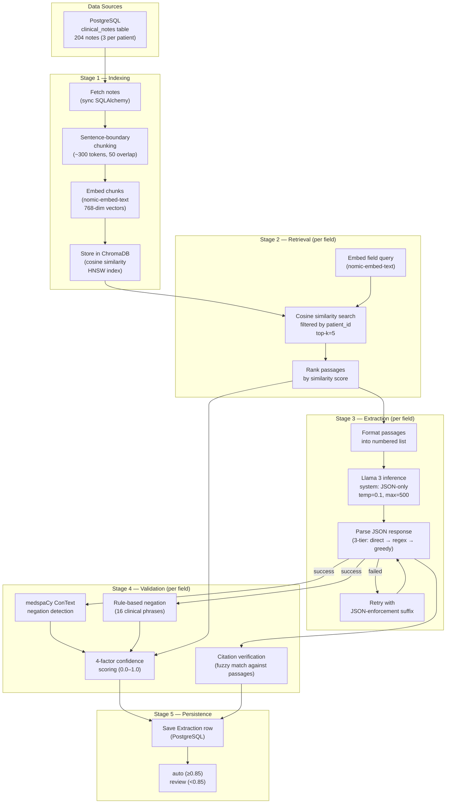
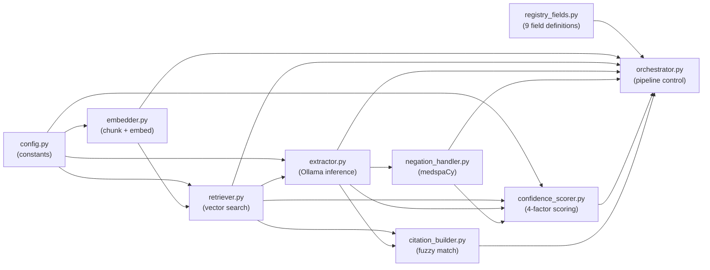

# LLM Architecture — TraumaInsight Extraction Pipeline

> Detailed technical documentation of the AI/LLM subsystem that powers automated trauma registry chart abstraction.

---

## Table of Contents

- [1. System Overview](#1-system-overview)
- [2. Model Inventory](#2-model-inventory)
- [3. Pipeline Architecture](#3-pipeline-architecture)
  - [3.1 High-Level Data Flow](#31-high-level-data-flow)
  - [3.2 Module Dependency Graph](#32-module-dependency-graph)
- [4. Module Deep Dives](#4-module-deep-dives)
  - [4.1 Embedder — Chunk & Embed](#41-embedder--chunk--embed)
  - [4.2 Retriever — Vector Search](#42-retriever--vector-search)
  - [4.3 Extractor — LLM Inference](#43-extractor--llm-inference)
  - [4.4 Negation Handler — Clinical NLP](#44-negation-handler--clinical-nlp)
  - [4.5 Confidence Scorer — Multi-Factor Scoring](#45-confidence-scorer--multi-factor-scoring)
  - [4.6 Citation Builder — Source Verification](#46-citation-builder--source-verification)
  - [4.7 Orchestrator — End-to-End Pipeline](#47-orchestrator--end-to-end-pipeline)
- [5. Prompt Engineering](#5-prompt-engineering)
  - [5.1 System Prompt](#51-system-prompt)
  - [5.2 Extraction Prompt Template](#52-extraction-prompt-template)
  - [5.3 Passage Formatting](#53-passage-formatting)
  - [5.4 JSON Output Contract](#54-json-output-contract)
- [6. Confidence Scoring Model](#6-confidence-scoring-model)
- [7. Error Handling & Resilience](#7-error-handling--resilience)
- [8. Data Schemas](#8-data-schemas)
- [9. Configuration Reference](#9-configuration-reference)
- [10. Performance Characteristics](#10-performance-characteristics)

---

## 1. System Overview

TraumaInsight's LLM subsystem is a **Retrieval-Augmented Generation (RAG)** pipeline that converts unstructured clinical notes into structured trauma registry fields. The entire system runs locally — no data leaves the machine.

```
                    ┌─────────────────────────────────────────────┐
                    │            TraumaInsight LLM Engine          │
                    │                                             │
  Clinical Notes    │  ┌──────────┐  ┌──────────┐  ┌──────────┐  │  Structured
  (free text)  ────▶│  │ Embedder │─▶│Retriever │─▶│Extractor │──┼─▶ Extractions
                    │  └──────────┘  └──────────┘  └────┬─────┘  │  (JSON)
                    │                                   │        │
                    │  ┌──────────┐  ┌──────────┐  ┌────▼─────┐  │
                    │  │ Citation │◀─┤ Scorer   │◀─┤ Negation │  │
                    │  │ Builder  │  │          │  │ Handler  │  │
                    │  └──────────┘  └──────────┘  └──────────┘  │
                    └─────────────────────────────────────────────┘
                           │              │              │
                      ┌────▼────┐   ┌─────▼────┐  ┌─────▼─────┐
                      │ChromaDB │   │  Ollama   │  │ medspaCy  │
                      │(vectors)│   │ (Llama 3) │  │ (ConText) │
                      └─────────┘   └──────────┘  └───────────┘
```

### Design Principles

| Principle | Implementation |
|-----------|---------------|
| **Privacy-first** | All models run locally via Ollama — zero external API calls (MIMIC-IV compliant) |
| **Grounded extraction** | RAG retrieves source passages before LLM inference — reduces hallucination |
| **Verifiable** | Every extraction includes a citation traced back to a specific clinical note |
| **Dual validation** | LLM output is cross-checked by a clinical NLP negation pipeline (medspaCy) |
| **Human-in-the-loop** | Confidence scoring auto-accepts high-confidence fields, flags uncertain ones for review |
| **Fault-tolerant** | Per-field error isolation — one failed extraction never crashes the patient batch |

---

## 2. Model Inventory

Three models serve different roles in the pipeline, all hosted locally via Ollama on port `11434`:

| Model | Role | Parameters | Quantization | Dim | Endpoint |
|-------|------|-----------|-------------|-----|----------|
| **Llama 3** (`llama3`) | Text extraction & reasoning | 8B | Q4_0 | — | `/api/generate` |
| **nomic-embed-text** | Embedding (documents + queries) | 137M | — | 768 | `/api/embed` |
| **BioMistral** (`cniongolo/biomistral`) | Alternative clinical extraction | 7B | Q4_0 | — | `/api/generate` |

Additionally, a non-LLM clinical NLP model is used:

| Model | Role | Library |
|-------|------|---------|
| **medspaCy** (en_core_web_sm + ConText) | Negation detection on clinical text | spaCy 3.8 + medspaCy 1.3 |

### Model Selection Rationale

- **Llama 3 (8B)** was chosen as the default for its strong instruction-following, JSON formatting compliance, and reasonable speed on consumer hardware. It handles clinical terminology well without being specifically fine-tuned for medicine.
- **nomic-embed-text** produces 768-dimensional embeddings optimized for retrieval tasks. It runs through Ollama's `/api/embed` endpoint, keeping the embedding pipeline on the same local infrastructure.
- **BioMistral** is available as an alternative for users who want a model fine-tuned on biomedical text (PubMed, clinical notes). It can be selected per-run via the `--model` flag.

---

## 3. Pipeline Architecture

### 3.1 High-Level Data Flow



### 3.2 Module Dependency Graph



**File sizes** (lines of code):

| Module | LOC | Role |
|--------|-----|------|
| `orchestrator.py` | 228 | Pipeline control |
| `registry_fields.py` | 188 | Field definitions & prompts |
| `embedder.py` | 173 | Chunking & embedding |
| `confidence_scorer.py` | 168 | Scoring engine |
| `extractor.py` | 152 | LLM interface |
| `negation_handler.py` | 135 | Clinical NLP |
| `retriever.py` | 78 | Vector search |
| `citation_builder.py` | 54 | Source verification |
| `config.py` | 28 | Constants |
| **Total** | **~1,200** | |

---

## 4. Module Deep Dives

### 4.1 Embedder — Chunk & Embed

**File:** [`backend/pipeline/embedder.py`](file:///Users/dennis_m_jose/Documents/GitHub/TraumaInsight-LLM-Powered-Entity-Extraction-Engine/backend/pipeline/embedder.py)

The embedder ingests clinical notes from PostgreSQL, chunks them, and stores vector embeddings in ChromaDB.

#### Chunking Strategy

```
┌─────────────────────────────────────────────────────────┐
│                    Clinical Note Text                    │
│ "Patient admitted with blunt trauma. CT showed splenic  │
│  laceration Grade III. Underwent exploratory laparotomy │
│  with splenectomy. No evidence of bowel injury..."      │
└───────────────────────┬─────────────────────────────────┘
                        │
                   Split on [.!?]
                        │
                        ▼
┌──────────────┐  ┌──────────────┐  ┌──────────────┐
│   Chunk 0    │  │   Chunk 1    │  │   Chunk 2    │
│  ~300 tokens │  │  ~300 tokens │  │  ~300 tokens │
│              │  │              │  │              │
│  ┌────────┐  │  │  ┌────────┐  │  │  ┌────────┐  │
│  │overlap │──┼──┼─▶│overlap │──┼──┼─▶│overlap │  │
│  │50 tok  │  │  │  │50 tok  │  │  │  │50 tok  │  │
│  └────────┘  │  │  └────────┘  │  │  └────────┘  │
└──────────────┘  └──────────────┘  └──────────────┘
```

- **Token approximation:** 1 token ≈ 4 characters
- **Chunk size:** 300 tokens (1,200 characters)
- **Overlap:** 50 tokens (200 characters) — ensures no information is lost at chunk boundaries
- **Splitting:** Regex on sentence endings (`[.!?]` followed by whitespace), preserving clinical abbreviations

#### Embedding API Call

```
POST http://localhost:11434/api/embed
{
  "model": "nomic-embed-text",
  "input": "Patient admitted with blunt trauma..."
}
→ {"embeddings": [[0.0123, -0.0456, ...]]}  // 768-dim vector
```

#### ChromaDB Storage

Each chunk is stored with metadata enabling patient-scoped retrieval:

```python
collection.upsert(
    ids=["{note_id}_{chunk_index}"],      # e.g. "note-abc_0"
    documents=["chunk text..."],           # raw text for display
    embeddings=[[0.01, -0.04, ...]],       # 768-dim nomic vector
    metadatas=[{
        "patient_id": "P-10001",
        "note_id": "note-abc",
        "note_type": "operative_report",   # | discharge_summary | radiology_report
        "chunk_index": 0
    }]
)
```

**ChromaDB configuration:** Persistent storage at `./chromadb_data/`, HNSW index with cosine distance metric.

#### Public Functions

| Function | Signature | Description |
|----------|-----------|-------------|
| `embed_patient` | `(patient_id, force=False) → int` | Embed all notes for one patient; returns chunk count |
| `embed_all_patients` | `() → dict` | Embed all patients; returns `{patients, total_chunks}` |
| `is_patient_embedded` | `(patient_id) → bool` | Check if embeddings exist |
| `clear_patient_embeddings` | `(patient_id) → int` | Delete embeddings for re-processing |

---

### 4.2 Retriever — Vector Search

**File:** [`backend/pipeline/retriever.py`](file:///Users/dennis_m_jose/Documents/GitHub/TraumaInsight-LLM-Powered-Entity-Extraction-Engine/backend/pipeline/retriever.py)

For each registry field, the retriever finds the most relevant clinical text passages.

#### Retrieval Process

```
Field Query                          ChromaDB Collection
"Did this patient develop           ┌──────────────────────┐
 sepsis during this                 │  P-10001 chunks (5)  │
 hospitalization?"                  │  P-10002 chunks (6)  │
        │                           │  P-10003 chunks (5)  │
        ▼                           │  ...204 notes total  │
  Embed query via                   └────────┬─────────────┘
  nomic-embed-text                           │
        │                     WHERE patient_id = "P-10001"
        │                                    │
        ▼                                    ▼
  ┌──────────────────────────────────────────────┐
  │  Cosine Similarity Search (filtered)         │
  │  query_embedding ● doc_embeddings            │
  │  → Top-5 passages ranked by similarity       │
  └──────────────────────────────────────────────┘
        │
        ▼
  RetrievedPassage(
    text="By POD#4780, patient was tolerating...",
    similarity_score=0.612,
    note_type="discharge_summary",
    note_id="note-xyz",
    chunk_index=2
  )
```

**Key detail:** ChromaDB returns cosine *distance*, which is converted to *similarity*: `similarity = 1.0 - distance`

#### Output Schema

```python
@dataclass
class RetrievedPassage:
    text: str               # raw passage text
    similarity_score: float # 0.0–1.0 (cosine similarity)
    note_type: str          # operative_report | discharge_summary | radiology_report
    note_id: str            # FK to clinical_notes table
    chunk_index: int        # position within the note
```

---

### 4.3 Extractor — LLM Inference

**File:** [`backend/pipeline/extractor.py`](file:///Users/dennis_m_jose/Documents/GitHub/TraumaInsight-LLM-Powered-Entity-Extraction-Engine/backend/pipeline/extractor.py)

The core LLM module that sends clinical passages + extraction prompt to Llama 3 and parses the structured JSON response.

#### Ollama API Call

```
POST http://localhost:11434/api/generate
{
  "model": "llama3",
  "system": "You are a clinical data extraction assistant.
             Always respond with a single valid JSON object
             and nothing else. Do not include any text before
             or after the JSON.",
  "prompt": "<extraction prompt with passages>",
  "stream": false,
  "options": {
    "temperature": 0.1,
    "num_predict": 500
  }
}
```

| Parameter | Value | Rationale |
|-----------|-------|-----------|
| `temperature` | 0.1 | Near-deterministic for factual extraction — avoid creative responses |
| `num_predict` | 500 | Enough for JSON output with value + citation + reasoning |
| `stream` | false | Synchronous — wait for complete response |
| `timeout` | 300s | Handles cold model loading (first call can take 30-60s) |

#### JSON Parsing Strategy (Three-Tier)

The LLM often wraps JSON in conversational text. A 3-tier parser handles this:

```
LLM Output: "Here is the response:\n\n{\"value\": \"Fracture of bone\"...}"
                                          │
          ┌───────────────────────────────┘
          ▼
  Tier 1: json.loads(text.strip())           →  Try direct parse
          │ fails
          ▼
  Tier 2: re.search(r"\{[^{}]*\}", text)     →  Find simple JSON object
          │ fails
          ▼
  Tier 3: re.search(r"\{.*\}", text)         →  Find any JSON (greedy)
          │ fails
          ▼
  Retry:  Re-prompt with "Respond ONLY with valid JSON. No other text."
          │ fails again
          ▼
  Return: ExtractionResult(success=False, error="Failed to parse JSON")
```

#### Output Schema

```python
@dataclass
class ExtractionResult:
    value: str          # "Fracture of bone (disorder)"
    citation: str       # "Patient was evaluated and found to have fracture of bone"
    reasoning: str      # "The primary injury is mentioned in the discharge summary"
    raw_response: str   # Full LLM output for debugging
    model: str          # "llama3"
    success: bool       # True if JSON parsed successfully
    error: str | None   # Error message if failed
```

---

### 4.4 Negation Handler — Clinical NLP

**File:** [`backend/pipeline/negation_handler.py`](file:///Users/dennis_m_jose/Documents/GitHub/TraumaInsight-LLM-Powered-Entity-Extraction-Engine/backend/pipeline/negation_handler.py)

Critical for complications fields: distinguishes *"no signs of infection"* from *"infection present"*. Uses a **dual-layer** approach.

#### Layer 1: medspaCy ConText

```python
nlp = medspacy.load()        # loads en_core_web_sm + ConText rules
doc = nlp(citation_text)
for ent in doc.ents:
    if ent.is_negated:        # ConText detected negation scope
        # → "infection" is negated in "no signs of infection"
```

medspaCy's ConText algorithm identifies negation scopes in clinical text:
- *"No evidence of DVT or PE"* → entities "DVT", "PE" are within negation scope
- *"Denies chest pain"* → "chest pain" is negated
- *"Blood cultures negative"* → infection-related entities are negated

#### Layer 2: Rule-Based Fallback

16 clinical negation patterns supplement medspaCy for cases it misses:

```python
_NEGATION_PHRASES = [
    "no evidence of",      "no signs of",
    "negative for",        "negative",
    "denied",              "no ",
    "not ",                "without ",
    "ruled out",           "ruled-out",
    "unlikely",            "none ",
    "absent",              "no documented",
    "no known",            "wound healing well",
]
```

#### Conflict Detection Logic

```
Extraction says "Yes — SSI"  +  Citation: "no signs of infection"
                │                            │
                ▼                            ▼
      _extraction_says_positive()     is_negated = True
      → True                                 │
                │                            │
                └──────────┬─────────────────┘
                           ▼
              conflicts_with_extraction = True
              → Flag for human review
```

#### Output Schema

```python
@dataclass
class NegationResult:
    is_negated: bool                    # negation detected in citation?
    negation_cues: list[str]            # ["no evidence of", "negative"]
    conflicts_with_extraction: bool     # True = extraction says Yes but citation is negated
    details: str                        # human-readable explanation
```

---

### 4.5 Confidence Scorer — Multi-Factor Scoring

**File:** [`backend/pipeline/confidence_scorer.py`](file:///Users/dennis_m_jose/Documents/GitHub/TraumaInsight-LLM-Powered-Entity-Extraction-Engine/backend/pipeline/confidence_scorer.py)

Produces a **0.0–1.0 confidence score** from four independent factors, then classifies as `auto` or `review`.

#### Scoring Formula

```
Final Score = 0.30 × Retrieval + 0.30 × Assertion + 0.20 × CrossDoc + 0.20 × Negation
```

#### Factor Details

| Factor | Weight | Input | Scoring Scale |
|--------|--------|-------|---------------|
| **Retrieval Quality** | 30% | Average cosine similarity of top-5 passages | Linear: 0.0 @ sim≤0.3, 1.0 @ sim≥0.8 |
| **Assertion Clarity** | 30% | Keywords in citation + extracted value | 1.0 if definitive ("confirmed", "Grade III", "s/p"), 0.5 if equivocal ("possible", "suspected"), 0.2 if empty ("not documented") |
| **Cross-Doc Agreement** | 20% | Distinct note types in retrieved passages | 1.0 if 3+ types, 0.7 if 2, 0.5 if 1 |
| **Negation Consistency** | 20% | Negation result vs extraction value | 1.0 if agrees, 0.8 if neutral, 0.2 if conflicts |

#### Keyword Lists

**Definitive** (→ 1.0): `confirmed`, `diagnosed with`, `grade I–V`, `s/p`, `status post`, `ais`, `underwent`, `performed`, `identified`, `demonstrated`, `revealed`

**Equivocal** (→ 0.5): `concern for`, `possible`, `cannot rule out`, `questionable`, `suspected`, `likely`, `probable`, `may represent`, `suggestive`, `uncertain`, `unclear`

#### Threshold Classification

```
Score ≥ 0.85  →  status = "auto"    (accepted without human review)
Score ≥ 0.60  →  status = "review"  (flagged for registrar)
Score < 0.60  →  status = "review"  (high-priority flag)
```

When `status = "review"`, a human-readable `conflict_reason` is generated:

| Condition | Reason String |
|-----------|--------------|
| retrieval < 0.5 | "Low retrieval similarity — relevant passages may not have been found" |
| assertion ≤ 0.5 | "Equivocal or uncertain language in clinical text" |
| cross_doc < 0.7 | "Limited cross-document support for this finding" |
| negation conflict | "Negation detected in citation but extraction value is positive" |
| default | "Confidence below auto-accept threshold" |

---

### 4.6 Citation Builder — Source Verification

**File:** [`backend/pipeline/citation_builder.py`](file:///Users/dennis_m_jose/Documents/GitHub/TraumaInsight-LLM-Powered-Entity-Extraction-Engine/backend/pipeline/citation_builder.py)

Verifies that the LLM's citation actually exists in the source text, preventing hallucinated evidence.

#### Verification Strategy

```
LLM Citation: "Patient was found to have splenic laceration Grade III"
                                    │
                   Fuzzy match (SequenceMatcher) against each passage
                                    │
              ┌─────────────────────┼───────────────────────┐
              ▼                     ▼                       ▼
         Passage 1             Passage 2               Passage 3
         score=0.72            score=0.31              score=0.15
              │
              ▼
     score ≥ 0.3 → Use LLM citation + passage's note_type
     score < 0.3 → HALLUCINATED — fall back to best passage text[:300]
```

**Returns:** `(citation_text, source_note_type)` — e.g., `("Patient was found to have...", "operative_report")`

---

### 4.7 Orchestrator — End-to-End Pipeline

**File:** [`backend/pipeline/orchestrator.py`](file:///Users/dennis_m_jose/Documents/GitHub/TraumaInsight-LLM-Powered-Entity-Extraction-Engine/backend/pipeline/orchestrator.py)

Ties all modules together for per-patient processing.

#### Execution Flow (per patient)

```
process_patient("P-10001", model="llama3")
  │
  ├── 1. Verify patient exists in PostgreSQL
  │
  ├── 2. Embed clinical notes (skip if already in ChromaDB)
  │       └── embed_patient("P-10001")
  │
  ├── 3. Delete existing extractions (clean slate)
  │       └── DELETE FROM extractions WHERE patient_id = 'P-10001'
  │
  ├── 4. For each of 9 REGISTRY_FIELDS:
  │       │
  │       ├── retrieve(patient_id, field.query)         → passages
  │       ├── extract(passages, field.prompt, model)     → extraction
  │       ├── check_negation(extraction, field)          → negation
  │       ├── score_extraction(passages, extraction, negation)  → confidence
  │       ├── build_citation(extraction, passages)       → citation
  │       │
  │       └── INSERT INTO extractions (
  │             patient_id, field_key, field_label, section,
  │             extracted_value, confidence_score, status,
  │             citation_text, source_note_type, conflict_reason,
  │             extraction_method = "rag"
  │           )
  │
  └── 5. Return summary {total_fields, auto_filled, needs_review, time}
```

#### Error Isolation

If any field's extraction fails, a placeholder is saved and the pipeline continues:

```python
Extraction(
    extracted_value="Extraction failed",
    confidence_score=0.0,
    status="review",
    conflict_reason="Pipeline error: {error_message}",
)
```

---

## 5. Prompt Engineering

### 5.1 System Prompt

Sent with every Ollama `/api/generate` call to enforce JSON output:

```
You are a clinical data extraction assistant.
Always respond with a single valid JSON object and nothing else.
Do not include any text before or after the JSON.
```

### 5.2 Extraction Prompt Template

Each field has a unique prompt. Example for `complication_ssi`:

```
Based on the clinical text excerpts below, determine if the
patient developed a Surgical Site Infection (SSI) during this
encounter. Look for: wound infection, incisional infection,
cellulitis at surgical site, positive wound cultures, or terms
like 'SSI'. IMPORTANT: Also check for NEGATION — phrases like
'no signs of infection', 'wound healing well', 'no SSI' mean
the answer is No.

Excerpts:
{passages}

Respond in JSON:
{"value": "Yes — [details]" or "No",
 "citation": "exact quote supporting your answer",
 "reasoning": "brief explanation including any negation detected"}
```

**Prompt design choices:**
- Explicit negation awareness in the prompt itself (defense in depth with medspaCy)
- Requested `reasoning` field helps the LLM "think step by step"
- Exact quote request in `citation` improves traceability
- Double-curly-brace JSON template shows the expected format

### 5.3 Passage Formatting

Retrieved passages are formatted into a numbered list with metadata:

```
[1] (Source: discharge_summary, similarity: 0.70)
DISCHARGE SUMMARY Patient: Lakiesha286 McLaughlin530 MRN: P-10001
Admit Date: 08/11/2011 Discharge Date: 09/12/2024...

[2] (Source: operative_report, similarity: 0.61)
OPERATIVE REPORT Date of Procedure: 08/11/2011 Surgeon: Dr. Sarah
Mitchell, MD, FACS...

[3] (Source: radiology_report, similarity: 0.57)
RADIOLOGY REPORT Exam: CT abdomen/pelvis with IV contrast...
```

Including the `similarity` score in the passage metadata gives the LLM a signal about relevance.

### 5.4 JSON Output Contract

Every extraction returns this structure:

```json
{
  "value": "Fracture of bone (disorder)",
  "citation": "Patient was evaluated by the trauma team and found to have fracture of bone (disorder).",
  "reasoning": "The primary traumatic injury is a fracture of bone, as mentioned in the discharge summary and radiology report."
}
```

---

## 6. Confidence Scoring Model

Visual breakdown of how a real extraction gets scored:

```
Example: primary_injury for P-10001
  Retrieved 5 passages: avg similarity = 0.612     (note range: 0.3–0.8)

  ┌────────────────────┬────────┬───────────────────────────────────┐
  │ Factor             │ Score  │ Reasoning                         │
  ├────────────────────┼────────┼───────────────────────────────────┤
  │ Retrieval (30%)    │  0.624 │ (0.612 - 0.3) / 0.5 = 0.624     │
  │ Assertion (30%)    │  1.000 │ "fracture" → definitive keyword  │
  │ Cross-doc (20%)    │  1.000 │ 3 note types in passages         │
  │ Negation (20%)     │  0.800 │ No negation cues (neutral)       │
  ├────────────────────┼────────┼───────────────────────────────────┤
  │ FINAL SCORE        │  0.827 │ 0.3×0.624 + 0.3×1.0 + 0.2×1.0   │
  │                    │        │ + 0.2×0.8 = 0.8472               │
  │ STATUS             │ review │ < 0.85 auto threshold            │
  └────────────────────┴────────┴───────────────────────────────────┘
```

---

## 7. Error Handling & Resilience

| Failure Mode | Handling | Result |
|-------------|----------|--------|
| Ollama not running | `requests.ConnectionError` caught | `ExtractionResult(success=False)` |
| Model cold start (>120s) | 300s timeout | Waits for model to load |
| LLM returns non-JSON | 3-tier regex parser | Extracts JSON from wrapper text |
| Parser fails | Retry with JSON-enforcement suffix | Second attempt |
| Parser fails twice | Return `success=False` | Saved as "Extraction failed" |
| medspaCy load fails | `try/except` fall-through | Rule-based negation only |
| Single field fails | Isolated `try/except` per field | Other 8 fields continue |
| Single patient fails | Isolated `try/except` per patient | Other patients continue |
| ChromaDB empty | `is_patient_embedded()` check | Auto-embeds before retrieval |
| Hallucinated citation | `SequenceMatcher` score < 0.3 | Falls back to best passage text |

---

## 8. Data Schemas

### Extraction Table (PostgreSQL)

The pipeline writes to the existing `extractions` table:

| Column | Type | Source Module |
|--------|------|--------------|
| `id` | UUID | orchestrator |
| `patient_id` | FK → patients | orchestrator |
| `source_note_id` | FK → clinical_notes | retriever (best passage) |
| `section` | String | registry_fields |
| `field_label` | String | registry_fields |
| `field_key` | String | registry_fields |
| `extracted_value` | String | extractor (LLM) |
| `confidence_score` | Float (0.0–1.0) | confidence_scorer |
| `status` | "auto" \| "review" | confidence_scorer |
| `citation_text` | Text | citation_builder |
| `source_note_type` | String | citation_builder |
| `conflict_reason` | Text (nullable) | confidence_scorer |
| `extraction_method` | "rag" | orchestrator |
| `extracted_at` | DateTime | database default |

---

## 9. Configuration Reference

All tunable parameters in [`backend/pipeline/config.py`](file:///Users/dennis_m_jose/Documents/GitHub/TraumaInsight-LLM-Powered-Entity-Extraction-Engine/backend/pipeline/config.py):

| Parameter | Default | Type | Description |
|-----------|---------|------|-------------|
| `OLLAMA_BASE_URL` | `http://localhost:11434` | str | Ollama API endpoint |
| `DEFAULT_LLM_MODEL` | `llama3` | str | Model for text extraction |
| `EMBEDDING_MODEL` | `nomic-embed-text` | str | Model for embeddings |
| `CHROMA_PERSIST_DIR` | `./chromadb_data` | str | ChromaDB storage path |
| `CHROMA_COLLECTION_NAME` | `clinical_notes` | str | Vector collection name |
| `CHUNK_SIZE` | 300 | int | Tokens per chunk (~1200 chars) |
| `CHUNK_OVERLAP` | 50 | int | Overlap between chunks (~200 chars) |
| `TOP_K_PASSAGES` | 5 | int | Passages retrieved per query |
| `AUTO_ACCEPT_THRESHOLD` | 0.85 | float | Score ≥ this → auto-accept |
| `REVIEW_THRESHOLD` | 0.60 | float | Score < this → high-priority review |
| `LLM_TEMPERATURE` | 0.1 | float | LLM sampling temperature |
| `LLM_MAX_TOKENS` | 500 | int | Max generation tokens |

---

## 10. Performance Characteristics

Measured on Apple Silicon (M-series) with Ollama serving Llama 3 8B Q4_0:

| Operation | Time | Notes |
|-----------|------|-------|
| Embed 1 patient (3 notes → 5 chunks) | ~5s | 5 × nomic-embed-text calls |
| Retrieve for 1 field | ~0.5s | Embed query + ChromaDB HNSW search |
| LLM extraction for 1 field | ~30-45s | Llama 3 8B inference (cold: ~120s) |
| Negation check for 1 field | ~0.1s | medspaCy NLP pipeline |
| Confidence scoring for 1 field | <0.01s | Pure computation |
| **Full pipeline for 1 patient (9 fields)** | **~5-7 min** | Dominated by 9 × LLM calls |
| Full pipeline for 68 patients | **~6-8 hrs** | Sequential processing |

**Bottleneck:** LLM inference accounts for ~95% of pipeline runtime. Using BioMistral (7B) has similar performance; smaller models like Llama 3.2 3B would be ~2× faster but may sacrifice extraction quality.
